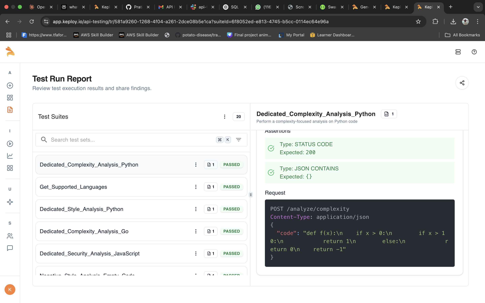
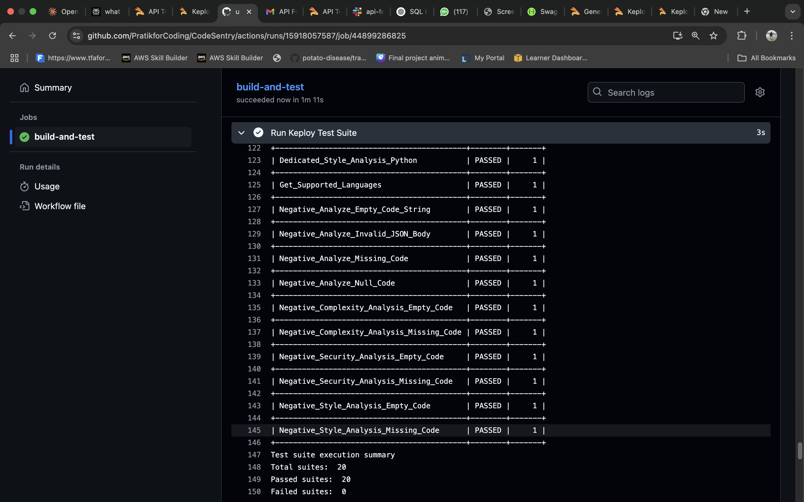

# 🛡️ CodeSentry

<div align="center">


**Your Guardian Against Code Vulnerabilities - A powerful, fast, and extensible code analysis API built with Go**

[Features](#-features) • [Quick Start](#-quick-start) • [API Documentation](#-api-documentation) • [Configuration](#-configuration) • [Contributing](#-contributing)

</div>

---

## 📋 Table of Contents

- [Overview](#-overview)
- [Features](#-features)
- [Architecture](#-architecture)
- [Quick Start](#-quick-start)
- [API Documentation](#-api-documentation)
- [Configuration](#-configuration)
- [Development](#-development)
- [Docker Deployment](#-docker-deployment)
- [Testing](#-testing)
- [Contributing](#-contributing)
- [License](#-license)

## 🚀 Overview

The **CodeSentry** is a comprehensive static code analysis service that helps developers identify security vulnerabilities, code complexity issues, style violations, and calculate detailed metrics across multiple programming languages. Built with Go and MongoDB, it provides both real-time analysis and persistent storage for analysis results.

### 🎯 Why CodeSentry?

- **🔒 Security First**: Detect common vulnerabilities like SQL injection, XSS, and hardcoded secrets
- **📊 Comprehensive Metrics**: Calculate complexity, maintainability, and quality scores
- **🎨 Style Consistency**: Enforce coding standards and best practices
- **🚀 High Performance**: Built with Go for speed and efficiency
- **📱 RESTful API**: Easy integration with any application or CI/CD pipeline
- **💾 Persistent Storage**: Store and retrieve analysis results with MongoDB
- **🐳 Docker Ready**: Containerized deployment with Docker Compose

## ✨ Features

### 🔍 **Multi-Language Support**
- **Go** - Full syntax and idiom analysis
- **JavaScript** - ES6+ features and Node.js patterns
- **Python** - PEP 8 compliance and security checks
- **Java** - Enterprise patterns and security scanning
- **SQL** - Injection vulnerability detection

### 🛡️ **Security Analysis**
- SQL Injection detection
- Cross-Site Scripting (XSS) vulnerabilities
- Path traversal attacks
- Hardcoded credentials and API keys
- Unsafe deserialization patterns
- Code injection risks

### 📈 **Complexity & Metrics**
- Cyclomatic complexity calculation
- Lines of code analysis
- Function and class counting
- Nesting depth analysis
- Comment ratio calculation
- Maintainability index

### 🎨 **Style & Quality**
- Code formatting validation
- Naming convention checks
- Line length enforcement
- Indentation consistency
- Best practice recommendations

### 💾 **Data Persistence**
- Store analysis results in MongoDB
- Retrieve historical analyses
- Update and delete stored analyses
- Query by various criteria

## 🏗️ Architecture

```
┌─────────────────┐    ┌─────────────────┐    ┌─────────────────┐
│   API Layer     │    │  Service Layer  │    │  Storage Layer  │
│                 │    │                 │    │                 │
│ • REST Routes   │◄──►│ • Analyzers     │◄──►│ • MongoDB       │
│ • Middleware    │    │ • Validators    │    │ • Collections   │
│ • Handlers      │    │ • Processors    │    │ • Indexes       │
└─────────────────┘    └─────────────────┘    └─────────────────┘
```

## 🚀 Quick Start

### Prerequisites

- **Go 1.24+**
- **Docker & Docker Compose**
- **Make** (optional but recommended)

### 1. Clone the Repository

```bash
git clone https://github.com/PratikforCoding/codesentry.git
cd codesentry
```

### 2. Start with Make Up

```bash
# Start all services (API + MongoDB)
make up

# Or manually using docker-compose
docker-compose up -d
```

### 3. Verify Installation

```bash
# Check health
curl http://localhost:8080/health

# Get supported languages
curl http://localhost:8080/api/v1/languages
```

### 4. Run Your First Analysis

```bash
curl -X POST http://localhost:8080/api/v1/analyze \
  -H "Content-Type: application/json" \
  -d '{
    "code": "func main() {\n    password := \"admin123\"\n    if user == \"admin\" {\n        fmt.Println(\"Welcome admin\")\n    }\n}",
    "language": "go",
    "options": {
      "check_security": true,
      "check_style": true,
      "check_complexity": true,
      "check_metrics": true
    }
  }'
```

## 📚 API Documentation

### 🔍 Analysis Endpoints

#### **POST** `/api/v1/analyze`
Complete code analysis with all checks enabled.

```bash
curl -X POST http://localhost:8080/api/v1/analyze \
  -H "Content-Type: application/json" \
  -d '{
    "code": "your_code_here",
    "language": "go",
    "options": {
      "check_security": true,
      "check_style": true,
      "check_complexity": true,
      "check_metrics": true
    }
  }'
```

#### **POST** `/api/v1/analyze/security`
Security-focused analysis only.

```bash
curl -X POST http://localhost:8080/api/v1/analyze/security \
  -H "Content-Type: application/json" \
  -d '{
    "code": "SELECT * FROM users WHERE id = \" + userId + \";"
  }'
```

#### **POST** `/api/v1/analyze/complexity`
Complexity analysis only.

```bash
curl -X POST http://localhost:8080/api/v1/analyze/complexity \
  -H "Content-Type: application/json" \
  -d '{
    "code": "def complex_function(x):\n    if x > 0:\n        for i in range(x):\n            if i % 2 == 0:\n                print(i)"
  }'
```

#### **POST** `/api/v1/analyze/style`
Style and formatting analysis only.

```bash
curl -X POST http://localhost:8080/api/v1/analyze/style \
  -H "Content-Type: application/json" \
  -d '{
    "code": "function badlyFormatted(){if(true){console.log(\"bad style\");}}"
  }'
```

### 📊 Analysis Management Endpoints

#### **GET** `/api/v1/analyses`
Retrieve all stored analyses with pagination.

```bash
curl "http://localhost:8080/api/v1/analyses"
```

#### **GET** `/api/v1/analyses/:id`
Get a specific analysis by ID.

```bash
curl http://localhost:8080/api/v1/analyses/64f8b2a1c9e4d5b6a7890123
```

#### **PUT** `/api/v1/analyses/:id`
Update an existing analysis.

```bash
curl -X PUT http://localhost:8080/api/v1/analyses/64f8b2a1c9e4d5b6a7890123 \
  -H "Content-Type: application/json" \
  -d '{
    "notes": "Updated analysis notes",
    "tags": ["reviewed", "fixed"]
  }'
```

#### **DELETE** `/api/v1/analyses/:id`
Delete an analysis.

```bash
curl -X DELETE http://localhost:8080/api/v1/analyses/64f8b2a1c9e4d5b6a7890123
```

### 🔧 Utility Endpoints

#### **GET** `/api/v1/languages`
Get list of supported programming languages.

#### **GET** `/health`
Health check endpoint.

## ⚙️ Configuration

### Environment Variables

Create a `.env` file in the root directory:

```env
# Server Configuration
PORT=8080
ENVIRONMENT=development

# MongoDB Configuration
MONGODB_URI=mongodb://localhost:27017
MONGODB_DATABASE=codesentry
MONGODB_COLLECTION=analyses

# Analysis Configuration
MAX_CODE_SIZE=1048576  # 1MB
ANALYSIS_TIMEOUT=30s
ENABLE_CACHING=true
CACHE_TTL=3600  # 1 hour

# Security
API_KEY_REQUIRED=false
CORS_ORIGINS=*
RATE_LIMIT_REQUESTS=100
RATE_LIMIT_WINDOW=60s
```

### Docker Compose Configuration

```yaml
version: '3.8'
services:
  api:
    build: .
    ports:
      - "8080:8080"
    environment:
      - MONGODB_URI=mongodb://mongodb:27017
    depends_on:
      - mongodb
    
  mongodb:
    image: mongo:6.0
    ports:
      - "27017:27017"
    volumes:
      - mongodb_data:/data/db

volumes:
  mongodb_data:
```

## 🛠️ Development

### Local Development Setup

```bash
# Install dependencies
make deps

# Run in development mode with hot reload
make dev

# Run tests
make test

# Run tests with coverage
make test-coverage

# Format code
make fmt

# Lint code
make lint
```

### Available Make Commands

```bash
make up             # Start all services
make down           # Stop all services
make build          # Build the application
make run            # Run the application
make dev            # Run with hot reload
make test           # Run tests
make test-coverage  # Run tests with coverage
make clean          # Clean build artifacts
make deps           # Install dependencies
make fmt            # Format code
make lint           # Lint code
make docker-build   # Build Docker image
make docker-run     # Run Docker container
make docker-up      # Start all services
make docker-down    # Stop all services
```

## 🐳 Docker Deployment

### Using Docker Compose (Recommended)

```bash
# Development environment
docker-compose up -d

# Production environment
docker-compose -f docker-compose.prod.yml up -d
```

### Manual Docker Deployment

```bash
# Build image
docker build -t codesentry .

# Run MongoDB
docker run -d --name mongodb -p 27017:27017 mongo:6.0

# Run API
docker run -d --name codesentry-api \
  -p 8080:8080 \
  -e MONGODB_URI=mongodb://mongodb:27017 \
  --link mongodb:mongodb \
  codesentry
```

## 🧪 Testing

### Running Tests (Will be integrated later)

```bash
# Run all tests 
make test

# Run with coverage
make test-coverage

# Run specific test
go test -v ./internal/services/...

# Run integration tests
go test -v -tags=integration ./tests/...
```


## 🔧 Customization

### Adding New Language Support

1. **Update Language Constants**
```go
// internal/models/types.go
const (
    Rust Language = "rust"  // Add new language
)
```

2. **Add Language Patterns**
```go
// internal/utils/patterns.go
func GetLanguageKeywords() map[models.Language][]string {
    return map[models.Language][]string{
        models.Rust: {"fn", "let", "mut", "impl", "trait", "match"},
    }
}
```

3. **Update Detection Logic**
```go
// internal/services/language_detector.go
if strings.Contains(code, "fn main()") {
    scores[models.Rust] += 10
}
```

### Custom Security Rules

```go
// internal/utils/patterns.go
var CustomSecurityPatterns = map[string]*regexp.Regexp{
    "custom_vulnerability": regexp.MustCompile(`your_pattern_here`),
}
```

## 🧪 API Testing with Keploy

Keploy makes API testing easy by recording and replaying requests as test cases. We can also generate API tests from OpenAPI Schema and curl requests.

### Example Test Results



### Below is the result of successful github Actions pipeline integration



## 🤝 Contributing

We welcome contributions! Please see our [Contributing Guide](CONTRIBUTING.md) for details.

### Development Process

1. **Fork** the repository
2. **Create** a feature branch (`git checkout -b feature/amazing-feature`)
3. **Commit** your changes (`git commit -m 'Add amazing feature'`)
4. **Push** to the branch (`git push origin feature/amazing-feature`)
5. **Open** a Pull Request

### Code Style

- Follow [Go Code Review Comments](https://github.com/golang/go/wiki/CodeReviewComments)
- Use `gofmt` for formatting
- Write tests for new features
- Update documentation

## 📄 License

This project is licensed under the MIT License - see the [LICENSE](LICENSE) file for details.

## 🙏 Acknowledgments

- [Gin Web Framework](https://github.com/gin-gonic/gin) - HTTP web framework
- [MongoDB Go Driver](https://github.com/mongodb/mongo-go-driver) - Database connectivity
- [Go Community](https://golang.org/community) - For the amazing ecosystem

---

<div align="center">

**[⬆ Back to Top](#-codesentry)**

Made with ❤️ by [Pratik Kotal](https://github.com/your-username)

</div>